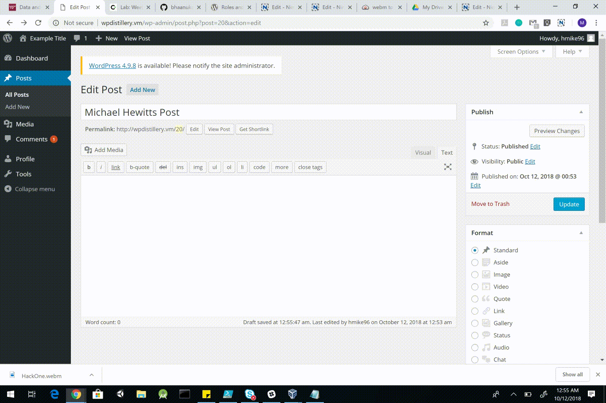
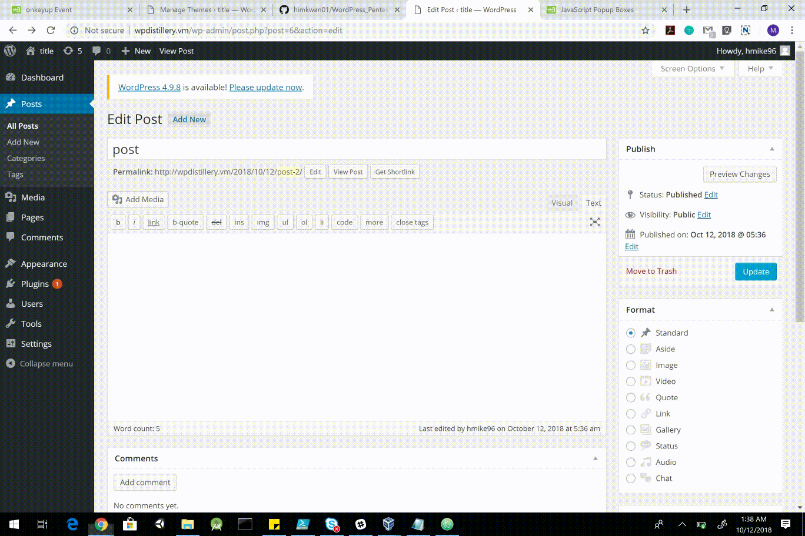
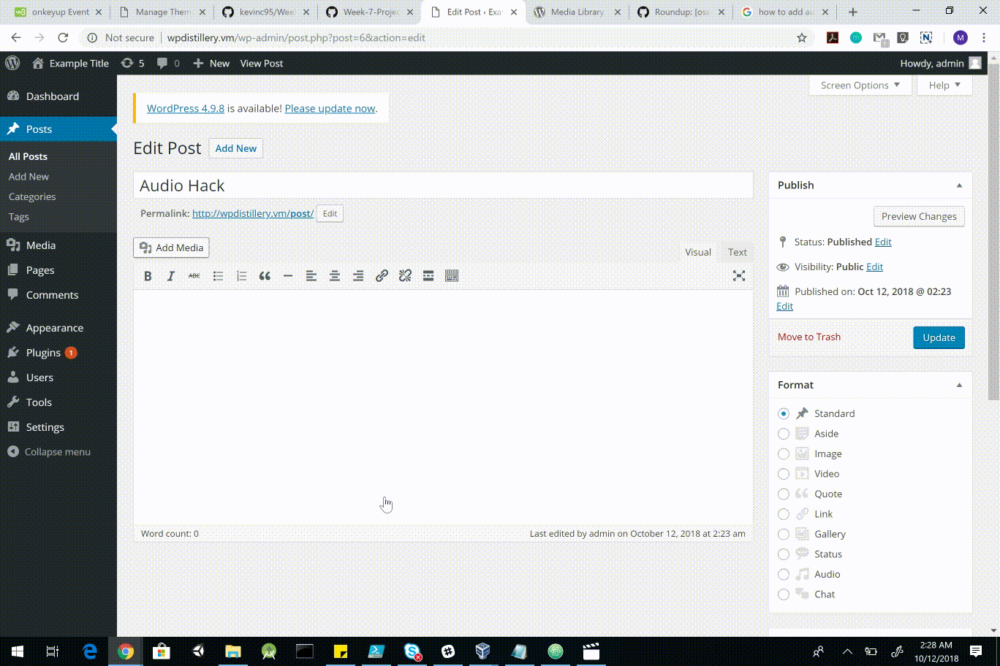

# Project 7 - WordPress Pentesting

Time spent: **10** hours spent in total

> Objective: Find, analyze, recreate, and document **five vulnerabilities** affecting an old version of WordPress

## Pentesting Report

1. (Required) WordPress <= 4.2 - Unauthenticated Stored Cross-Site Scripting (XSS)
  - [X] Summary: 
    - Vulnerability types: XSS
    - Tested in version: 4.2.0
    - Fixed in version: 4.2.1
  - [X] GIF Walkthrough: 
  - [ ] Steps to recreate: Comment on a post with the following -
  > <a title='x onmouseover=alert(unescape(/hello%20world/.source)) style=position:absolute;left:0;top:0;width:5000px;height:5000px   
  > <insert greater than 63kb of any data>'></a>
  - [X] Affected source code: https://cedricvb.be/post/wordpress-stored-xss-vulnerability-4-1-2/
    - [Link 1](https://klikki.fi/adv/wordpress2.html)
1. (Required) Authenticated Stored Cross-Site Scripting (XSS) in YouTube URL Embeds
  - [X] Summary: 
    - Vulnerability types: XSS
    - Tested in version: 4.2.0
    - Fixed in version: 4.7.3
  - [X] GIF Walkthrough: 
  - [ ] Steps to recreate: 
  - [X] Affected source code: https://github.com/WordPress/WordPress/commit/419c8d97ce8df7d5004ee0b566bc5e095f0a6ca8
    - [Link 1](https://blog.sucuri.net/2017/03/stored-xss-in-wordpress-core.html)
1. (Required) 4.3 - Authenticated Shortcode Tags Cross-Site Scripting (XSS)
  - [X] Summary: 
    - Vulnerability types: XSS
    - Tested in version: 4.2
    - Fixed in version: 4.3.1
  - [X] GIF Walkthrough: 
  - [ ] Steps to recreate: 
  - [X] Affected source code: https://blog.checkpoint.com/2015/09/15/finding-vulnerabilities-in-core-wordpress-a-bug-hunters-trilogy-part-iii-ultimatum/
    - [Link 1](https://blog.sucuri.net/2017/03/stored-xss-in-wordpress-core.html)
1. (Optional) WordPress 4.5.3 Audio Playlist Cross Site Scripting
  - [X] Summary: 
    - Vulnerability types: XSS
    - Tested in version: 4.5.3
    - Fixed in version: 4.7.3
  - [X] GIF Walkthrough: 
  - [ ] Steps to recreate: 
  - [X] Affected source code: https://sumofpwn.nl/advisory/2016/wordpress_audio_playlist_functionality_is_affected_by_cross_site_scripting.html
    - [Link 1](https://cxsecurity.com/issue/WLB-2017030066)
